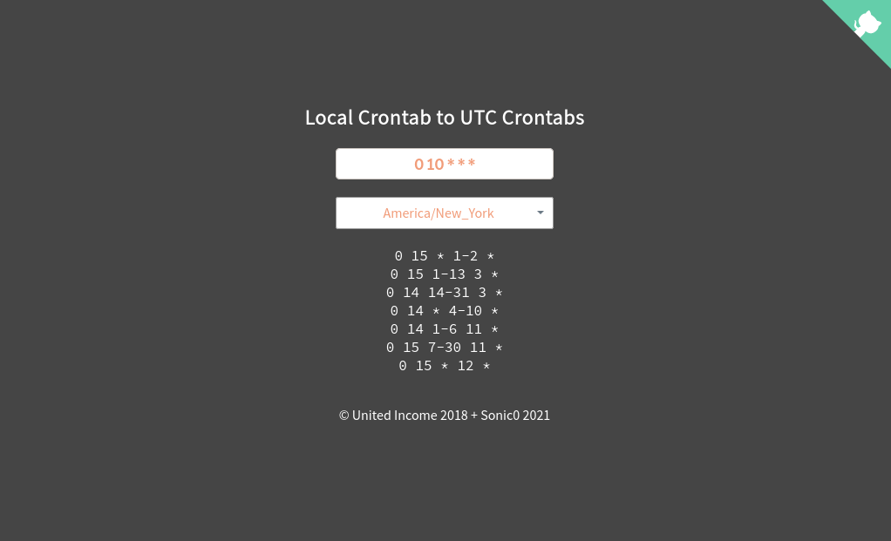

<p align="center">
  
</p>

local-crontab is a Python wheel and command line utility to convert a crontab, in a local timezone, into a set of UTC crontabs. 
It creates multiple UTC crontabs because of Daylight Saving Time.<br>
This project is based to [local-crontab](https://github.com/UnitedIncome/local-crontab) by [UnitedIncome](https://github.com/UnitedIncome) with some bug fixes.

I added the possibility to convert a crontab, in a local timezone, into an UTC crontab, but only for hour and day parts.
This feature is useful to automate some simple convertions, but it is necessary a "_dst check_" program (external) to maintain the sync during the year with original local timezone.
This feature in not available to online converter.

## Use it online!
Check it out at [sonic0.github.io/local-crontab-web-converter](https://sonic0.github.io/local-crontab-web-converter)
[](https://sonic0.github.io/local-crontab-web-converter)

## Use as a script
```
$ local-crontab --help
Usage: command_line.py [OPTIONS] CRONTAB

  Convert a crontab, in a localized timezone, into a set of UTC crontabs.

Options:
  --t, --timezone TZ    The timezone to use. Defaults to system timezone
  --help                Show this help message and exit.
  --version             Show program's version number and exit.

# year 2021
$ local-crontab --timezone America/New_York '0 10 * * *'
0 15 * 1-2 *
0 15 1-13 3 *
0 14 14-31 3 *
0 14 * 4-10 *
0 14 1-6 11 *
0 15 7-30 11 *
0 15 * 12 *

# year 2021
$ local-crontab --timezone America/Denver '0 10 * * *'
0 17 * 1-2 *
0 17 1-13 3 *
0 16 14-31 3 *
0 16 * 4-10 *
0 16 1-6 11 *
0 17 7-30 11 *
0 17 * 12 *

# year 2021, month july
$ local-crontab --timezone America/New_York --shift '0 23 3 * *'
0 3 4 * *
```

## Use as a library
Install with `pip install local-crontab`:

```python
from local_crontab import Converter
Converter('0 10 * * *', 'America/New_York').to_utc_crons()
# returns
['0 15 * 1-2,12 *',
 '0 15 1-10 3 *',
 '0 14 11-31 3 *',
 '0 14 * 4-10 *',
 '0 14 1-3 11 *',
 '0 15 4-31 11 *']                                               
```

```python
from local_crontab import Converter
Converter('0 23 3 * *', 'America/New_York').to_utc_cron()
# returns
'0 3 4 * *'                                      
```

## Project info
This repo is part of my projects group, called _Cron-Converter_.
Its related repositories:

- [cron-converter](https://github.com/Sonic0/cron-converter)
- [local-crontab-ansible-filter](https://github.com/Sonic0/local-crontab-ansible-filter)
- [local-crontab-serverless-infrastructure](https://github.com/Sonic0/local-crontab-serverless-infrastructure)
- [local-crontab-web-converter](https://github.com/Sonic0/local-crontab-web-converter)
